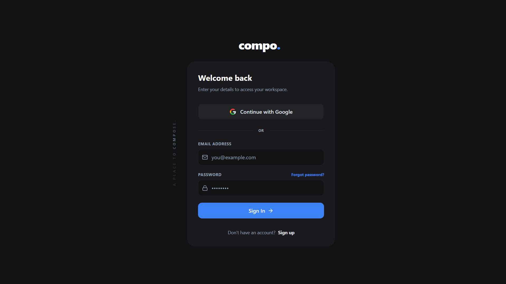
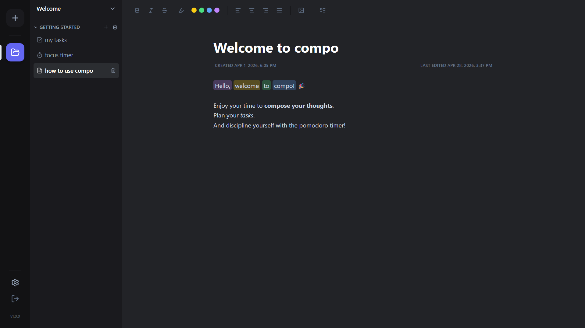
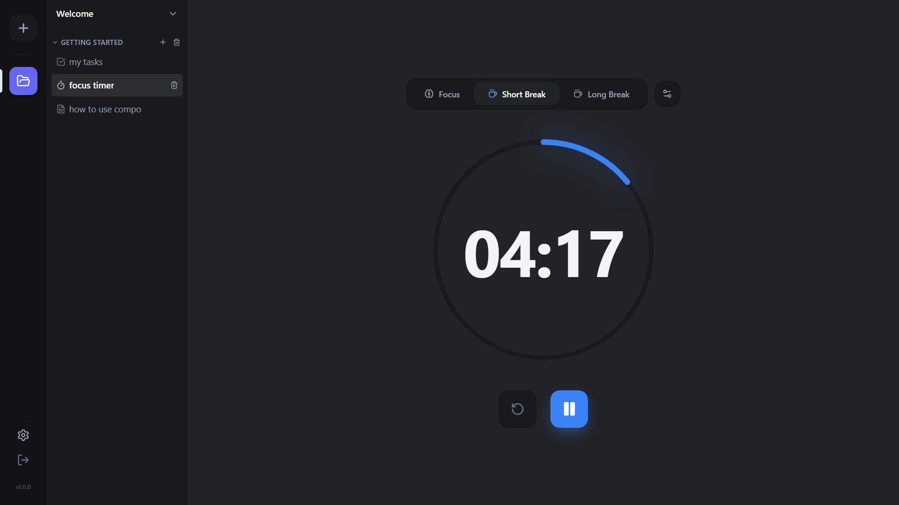
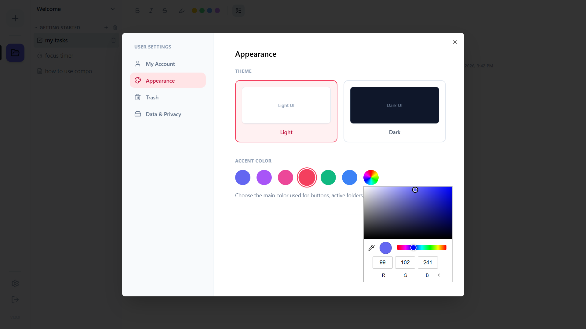

 

  

  <h1 align="center">Compo</h1>

  

     
    <a href="https://compo-note.netlify.app"><strong>View Live Demo »</strong></a>
     
     
    <a href="https://github.com/aikeen8/compo/issues">Report Bug</a>
    ·
    <a href="https://github.com/aikeen8/compo/issues">Request Feature</a>
  

### Features

* **smart organization:** group your notes and to-dos in custom color-coded folders.
* **focus timer:** a built-in pomodoro timer to track your work sessions.
* **drag and drop:** easily move folders around in your sidebar.
* **Privacy Lock:** Keep your workspace private with a 4-digit PIN so only you can see your notes.

### Built with

* react
* typescript
* tailwind css
* supabase
* vite

## Application Snapshots

| **Login screen** | **Main content** |
|:---:|:---:|
| |  |

| **Pomodoro** | **Settings** |
|:---:|:---:|
|  |  |

## Contributor

| name | avatar | role | contributions |
| :---: | :--- | :--- | :--- |
| **[Kate Aikeen Fabiani](https://github.com/aikeen8)** |  | Developer | Designed and built the entire application. |

